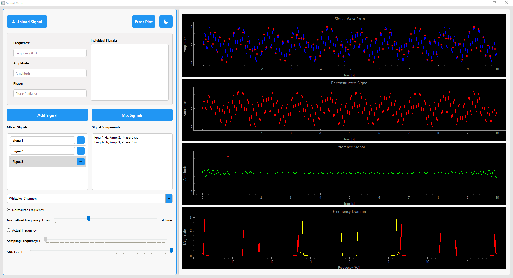

# Sampling-Theory Studio

   

   <video width="600" controls>
      <source src="./Assets/video.mp4" type="video/mp4">
      Your browser does not support the video tag.
   </video>

## Overview
**Sampling-Theory Studio** is a desktop application designed to demonstrate the fundamentals of signal sampling and reconstruction, highlighting the importance and validation of the Nyquist–Shannon sampling theorem. This theorem ensures that an analog signal can be fully reconstructed if sampled at a rate at least twice its maximum frequency. This application serves as an interactive educational tool for exploring how different sampling frequencies affect the reconstruction of signals and how aliasing can occur when undersampling.

## Features
### 1. **Load & Compose**
   - Load signals from external files or create them within the application.
   - Use the **Signal Mixer** to add multiple sinusoidal components with customizable frequencies and magnitudes.
   - Easily remove signal components and reset to default values, ensuring a smooth user experience.

### 2. **Sample & Recover**
   - Load and visualize signals of approximately 1000 data points.
   - Sample the signal at various frequencies, visualizing the sampled points.
   - Reconstruct the original signal from sampled points using the Whittaker–Shannon interpolation formula.
   - Present results across four interactive graphs:
     - **Original Signal**: Displays the original signal with sampling markers.
     - **Reconstructed Signal**: Shows the signal after reconstruction.
     - **Difference Graph**: Highlights the differences between original and reconstructed signals.
     - **Frequency Domain Analysis**: Provides insights on aliasing and frequency overlap.

### 3. **Additive Noise**
   - Add custom noise with adjustable SNR (Signal-to-Noise Ratio).
   - Observe how noise impacts the signal frequency and reconstruction quality.

### 4. **Real-time Processing**
   - Sampling and reconstruction operations happen in real-time, automatically updating with user modifications, without any “Refresh” or “Update” button.

### 5. **Reconstruction Methods**
   - Explore different signal reconstruction techniques.
   - Select from a variety of reconstruction methods using a dropdown menu, each with unique strengths and limitations.
   - Ideal for comparing Whittaker–Shannon interpolation with other approaches.

## Signal Processing
The **Sampling-Theory Studio** relies on signal processing techniques to demonstrate key concepts:

- **Sampling**: Converts the continuous signal into discrete points. The sampling frequency can be adjusted by the user to explore effects such as aliasing.
- **Reconstruction**: Uses the Whittaker–Shannon interpolation formula for default reconstruction, and additional methods are available for comparison.
- **Frequency Analysis**: Provides insights into the frequency components of signals, helping users identify aliasing when sampling below the Nyquist rate.
- **Additive Noise Control**: Allows users to add noise and observe its effect on the signal quality, particularly in relation to the signal frequency and SNR.

   
